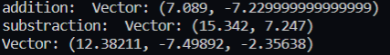
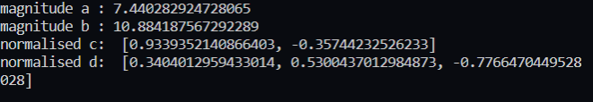
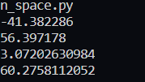

Taken from this course: 
https://eu.udacity.com/course/linear-algebra-refresher-course--ud953

1. Cartesian coordinates
2. Vector : change in location

3. Defining a vector using python:

4. vector operations:

5. process of finding a unit vector:
Through normalisation
1/ ||v|| * v  = unit vector in that direction

||v|| = magnitude of v = sqrt(vx^2 + vy^2)
where vx and vy are individual vectors in x and y axis

note of caution a zero vector does not have unit vector.

6.  Dot product

v.w  = ||v|| . ||w|| . cos theta

chauchy swartz inequality 

|| v.w || <= ||v|| . ||w||

theta = arccosine (v.w/||v||.||w||)

if v.w = - v.mag() . w.mag() it means the vectors are in opposite directions
if v.w = v.mag() . w.mag() it means the vectors are in the same line

if v.w = 0 it means either they are at 90 degrees to each other or one of them is zero.

v.mag() = sqrt(v.dot(v))

anglewith and dotproducts:

Next :
https://classroom.udacity.com/courses/ud953/lessons/4374471116/concepts/45834932720923