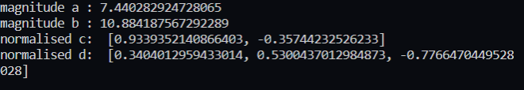
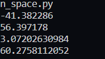
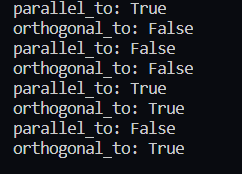
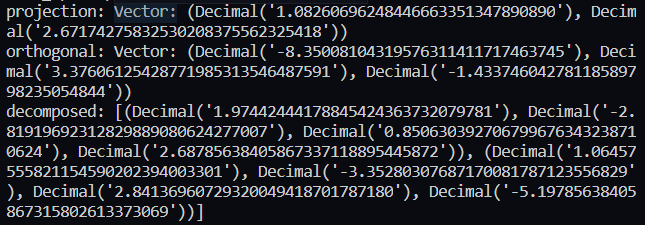
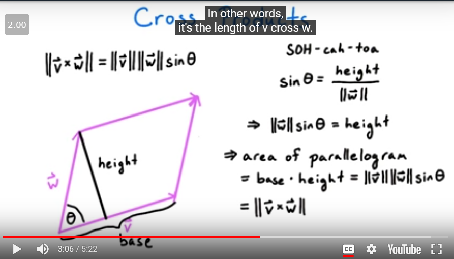
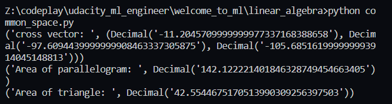

Taken from this course: 
https://eu.udacity.com/course/linear-algebra-refresher-course--ud953

1. Cartesian coordinates
2. Vector : change in location

3. Defining a vector using python:

4. vector operations:

5. process of finding a unit vector:
Through normalisation
`1/ ||v|| * v  = unit vector in that direction`

`||v|| = magnitude of v = sqrt(vx^2 + vy^2)`
where vx and vy are individual vectors in x and y axis

note of caution a zero vector does not have unit vector.

6.  Dot product

`v.w  = ||v|| . ||w|| . cos theta`

chauchy swartz inequality 

`|| v.w || <= ||v|| . ||w||`

which implies

`theta = arccosine (v.w/||v||.||w||)`

if v.w = - v.mag() . w.mag() it means the vectors are in opposite directions
if v.w = v.mag() . w.mag() it means the vectors are in the same line

if v.w = 0 it means either they are at 90 degrees to each other or one of them is zero.

`v.mag() = sqrt(v.dot(v))`

anglewith and dotproducts:

7. Vectors are aprallelif one vector is a scalar product of the ither

checking if vectors are zero or orthogonal, fir irthiginal the doduct must be zero

8. orthogonality helps in decomposing of the vectors
A vector can be decomposed into its parallel and projected component on a vector

9. cross product
is a vector that is orthogonal to both v and w

`||v x w|| = ||v||||w||sin theta`
if theta = 0 or pi cross product isalso equal to 0

`V x W = [y1z2 - y2z1, - (x1z2 - x2z1), x1y2 -x2y1]`

area of parrellolgram = `sqrt(x^2 + y^2 + z^2)`

